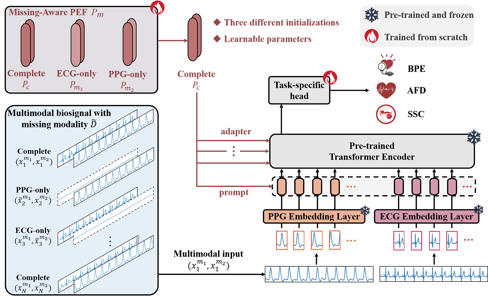

# Multi-View-Fusion-View-Missing-in-Cardiovascular-Signals
Official Implementation of *Neural Networks* paper " Efficient multi-view fusion and flexible adaptation to view missing in 
cardiovascular system signals". You can access our paper [here](https://www.sciencedirect.com/science/article/pii/S0893608024006841)
## Introduction
This paper examines two key issues in multi-view physiological signals: 1) how to effectively leverage large-scale unlabeled data to obtain multi-view fused representations, thereby advancing various downstream tasks in the healthcare field; 2) how to effectively mitigate the missing-view problem in a real-world application. Thus, we propose a **View-Centric Transformer (VCT)** coupled with a **Multi-task Masked AutoEncoder (M2AE)** to enhance multi-view fusion. Besides, we introduce, for the first time, a parameter-efficient fine-tuning prompt learning technique designed to alleviate view missing. The experiment involves two typical signals: **PPG** and **ECG** and various tasks: **blood pressure estimation**, **atrial fibrillation detection**, and **sleep stage classification**.
<div align="center">
  
  <p><em>Figure 1: Multitask Masked Autoencoder</em></p>
</div>

<div align="center">
  
  <p><em>Figure 2: Missing-Aware Prompt</em></p>
</div>

## Environment
### Prerequisites
Python==3.7.13<br>torch==1.10.0<br>pytorch-lightning==1.1.4<br>torchmetrics==0.9.3<br>transformers==4.2.1
### Other requirements
```pip install -r requirements.txt```
## Dataset Preparation
We use three common datasets of physiological signals: [PusleDB](https://github.com/pulselabteam/PulseDB), [MESA](https://sleepdata.org/datasets/mesa), and [PERformAF](https://zenodo.org/records/6973963).It should be noted that the MESA and PERformAF datasets need preprocessing, dataset division, and so on, while the PulseDB dataset can be used directly. We do not distribute datasets because of the license issue.
Please download the datasets by yourself. We use ``pyarrow`` to serialize the datasets, conversion scripts are located in ``mmbt/utils/write_*.py``.
Taking ``write_pulsedb`` as an example: ``load_path`` is the path to the *. mat file in PulseDB, ``split`` indicates whether the final file is a training set, validation set, or test set, ``concatenated_file_path`` indicates the final *. arrow storage path. Finally, organize the dataset in the following structure.
```
    datasets
    ├── PulseDB            
    │   ├── PulseDB_train.arrow               
    │   ├── PulseDB_val.arrow              
    │   ├── PulseDB_test.arrow       
    ├── MESA          
    │   └── ...          
    ├── PERformAF
    │   └── ...
    ├── pretrain_arrows
    │   └── ...
```
## Usage
The script ``run_script.py`` contains three examples: 1) pretraining VCT based on M2AE; 2) finetuning the pretrained VCT for downstream tasks; 3) finetuning the pretrained model based on prompt learning for missing view scenarios.<br> For example, you could test your finetuned model on downstream tasks:
```
python main.py with data_root=<ARROW_ROOT> \
        num_gpus=<NUM_GPUS> \
        per_gpu_batchsize=<BATCHSIZE_FITS_YOUR_GPU> \
        <test_pulsedb or test_performaf or test_mesa> \
        load_path=<MODEL_PATH> \
        exp_name=<EXP_NAME> \
        test_only=True     
```
The pretrained model can be downloaded [here](https://1drv.ms/u/c/299cf8fe2e3c4bc6/ER2FfZJKDS5MnRWUGNdSyt8BiPtniYa8C-SBqsZ7Mw0EJg?e=674Zkb)
## Citation
If you find this work useful for your research, please cite:<br>
``Hu Q, Wang D, Wu H, et al. Efficient multi-view fusion and flexible adaptation to view missing in cardiovascular system signals[J]. Neural Networks, 2025, 181: 106760.``
## Acknowledgements
Thanks for the inspiration from [ViLT](https://github.com/dandelin/ViLT), [M3AE](https://github.com/zhjohnchan/M3AE), and [Prompt](https://github.com/YiLunLee/missing_aware_prompts)


